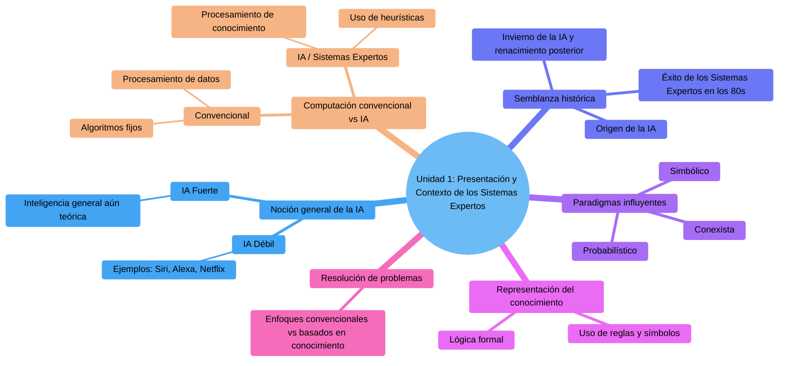

# Microevaluacion3

---

## Unidad 1: Presentación y Contexto de los Sistemas Expertos

```mermaid
%%{init: {'theme': 'base', 'themeVariables': { 'primaryColor': '#e3f2fd', 'edgeLabelBackground':'#ffffff', 'background':'#ffffff', 'primaryTextColor':'#000000', 'nodeTextColor':'#000000', 'lineColor':'#2196f3', 'secondaryColor':'#bbdefb'}}}%%
mindmap
  root((Unidad 1: Presentación y Contexto de los Sistemas Expertos))
    Noción general de la IA
      IA Débil
        Ejemplos: Siri, Alexa, Netflix
      IA Fuerte
        Inteligencia general aún teórica
    Computación convencional vs IA
      Convencional
        Algoritmos fijos
        Procesamiento de datos
      IA / Sistemas Expertos
        Procesamiento de conocimiento
        Uso de heurísticas
    Semblanza histórica
      Origen de la IA
      Éxito de los Sistemas Expertos en los 80s
      Invierno de la IA y renacimiento posterior
    Paradigmas influyentes
      Simbólico
      Conexista
      Probabilístico
    Representación del conocimiento
      Uso de reglas y símbolos
      Lógica formal
    Resolución de problemas
      Enfoques convencionales vs basados en conocimiento

```
