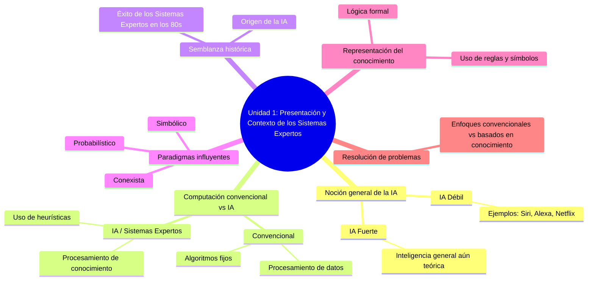
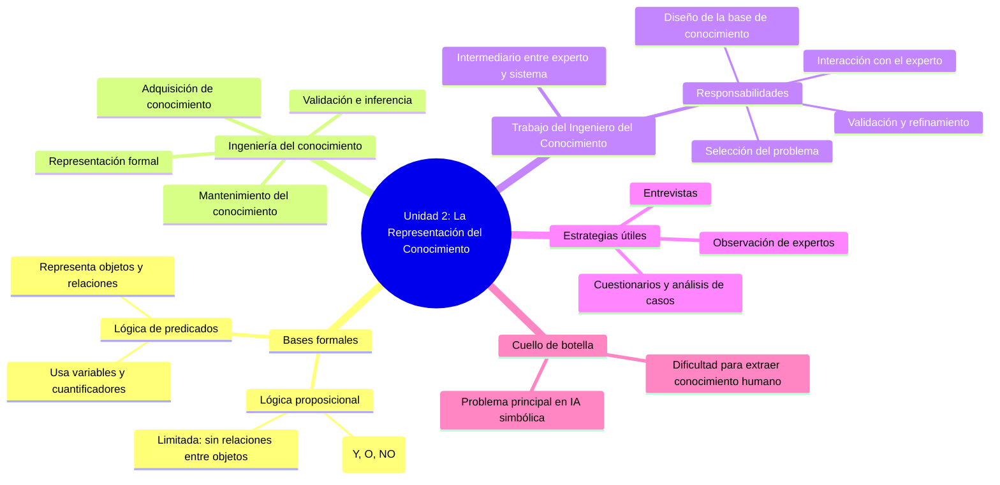
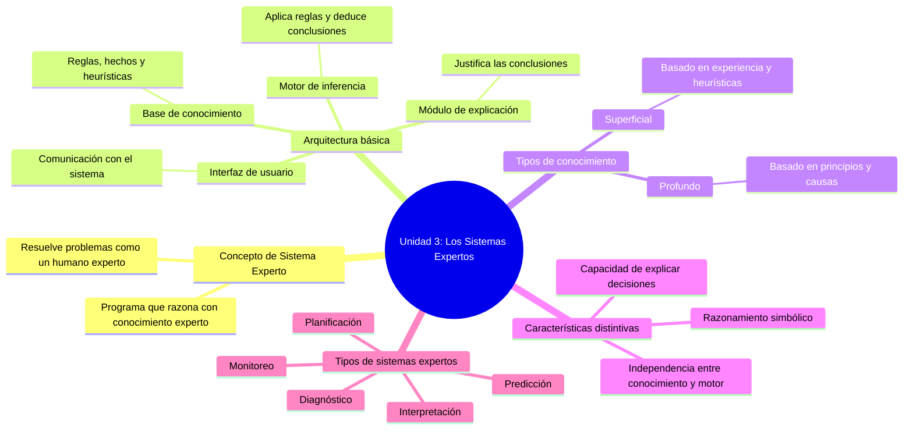

# Microevaluacion3

---

## Unidad 1: Presentación y Contexto de los Sistemas Expertos

---

## Unidad 2: La Representación del Conocimiento

---

## Unidad 3: Los Sistemas Expertos, Definición y Conceptos

